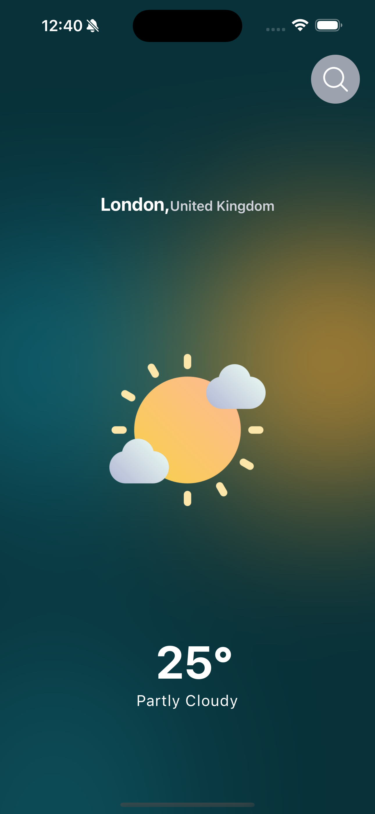

# React Native Weather App

This project is part of my journey to learn React Native, inspired by the [Code with Nomi](https://www.youtube.com/watch?v=953vyZMO4cM&list=PLKWMD009Q4qSHIMF6Swy4VQs5z6U97LJm&index=2) YouTube series. Each feature and component I build reflects the steps in the tutorial series, along with my own enhancements and understanding.

## Table of Contents
- [Project Overview](#project-overview)
- [Setup and Installation](#setup-and-installation)
- [Features](#features)
- [Progress and Screenshots](#progress-and-screenshots)
- [Acknowledgments](#acknowledgments)

## Project Overview
This repository contains a React Native weather app built by following the [Code with Nomi](https://www.youtube.com/@CodeWithNomi) tutorial series. It’s designed for beginners like me who want to gain practical experience with React Native while building a functional and visually appealing weather app.

## Setup and Installation
To run this project locally:

1. Clone the repository:
   ```bash
   git clone https://github.com/kwamena98/Weather-App-React-Native-.git
   ```

2. Navigate to the project directory:
   ```bash
   cd react-native-weather-app
   ```

3. Install dependencies:
   ```bash
   npm install
   ```
   or
   ```bash
   yarn install
   ```

4. Start the development server:
   ```bash
   npx expo start
   ```

5. Follow instructions in the terminal to view the app on an emulator or real device.

## Features
- **Feature 1**: Fetch current weather data for a given location.
- **Feature 2**: Display a 5-day weather forecast.
- **Feature 3**: Search functionality to find weather details for different cities.
- **Feature 4**: User-friendly UI with animations and styled components.
- **Feature 5**: Integration with a weather API 

More features will be added as I progress through the tutorial.

## Progress and Screenshots
For every major commit, I’ve included a screenshot to show the progress I’ve made. Here’s a glimpse:

| Commit | Screenshot |
|--------|------------|
| In the beginning |  |
| SearchBar,ImageDisplay,Temperature,condition,searchToggle |  |


_Note: Screenshots are stored in the `screenshots/` directory._

## Acknowledgments
- Huge thanks to [Code with Nomi](https://www.youtube.com/@CodeWithNomi) for the excellent React Native tutorial series.
- This README and project structure were inspired by best practices for learning and documenting progress.

